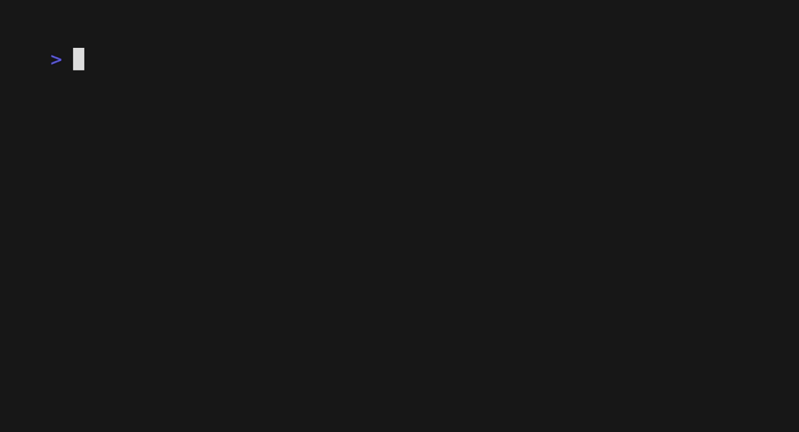

[](https://github.com/mdb/gh-dispatch/actions/workflows/cicd.yaml)

# gh-dispatch

`gh-dispatch` is a [gh CLI](https://cli.github.com/) extension for triggering [repository_dispatch](https://docs.github.com/en/rest/repos/repos#create-a-repository-dispatch-event) and/or
[workflow_dispatch](https://docs.github.com/en/actions/using-workflows/events-that-trigger-workflows#workflow_dispatch) events and watching the resulting GitHub Actions workflow run via
a single command.



## Usage

Trigger a repository dispatch event and watch the resulting GitHub Actions run from your terminal:

```
gh dispatch repository \
  --repo "mdb/gh-dispatch" \
  --event-type "hello" \
  --client-payload "{\"name\": \"mike\"}" \
  --workflow "Hello"'
```

Trigger a workflow dispatch event and watch the resulting GitHub Actions run from your terminal:

```
gh dispatch workflow \
  --repo "mdb/gh-dispatch" \
  --inputs "{\"name\": \"mike\", "force_fail": "false"}' \
  --workflow workflow_dispatch.yaml
```

## Installation

Install the `gh` CLI [for your platform](https://github.com/cli/cli#installation). For example, on Mac OS:

```
brew install gh
```

Install the latest `dispatch` extension from [its pre-compiled releases](https://github.com/mdb/gh-dispatch/releases):

```
gh extension install mdb/gh-dispatch
```

## Development

Build and test `gh-dispatch` locally:

```
make
```

Install a locally built `gh-dispatch`, thus making it available `gh dispatch`:

```
make install
```
